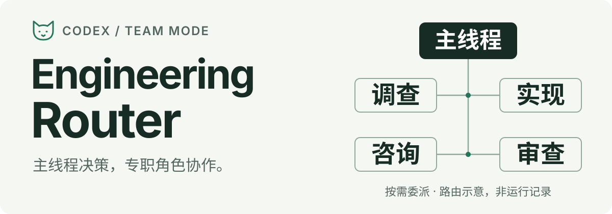

# 🐈 Engineering Router

<p align="center">
  
</p>

为 Codex 软件工程任务提供明确的分工、模型路由和独立审查规则。

主线程掌握决策和交付，六种专职角色承担有界工作。简单任务不必开小队，复杂任务按风险选择角色，而不是一律启动更多 agent。

[安装](#安装) · [使用示例](#使用) · [分工与模型](#分工与模型) · [诊断与用量](#诊断与用量) · [版本记录](CHANGELOG.md)

> 使用前须知：只读角色可能继承主线程的写权限。本项目不提供独立的沙箱隔离保证；权限不匹配时应停止该路由。详见[权限与适用边界](#权限与适用边界)。

## 使用

安装后，在新 Codex chat 中给出目标和边界，例如：

```text
$engineering-router
修复这个模块的重复提交问题，保持现有 API 不变并补回归测试。
先调查影响范围；涉及并发或数据一致性时，走高风险实现与独立审查。
```

首次激活会输出 `🐈 已开启小队模式。`；英文为 `🐈 Team Mode activated.`，同一轮只出现一次。

### 小队如何工作

- **按需委派**：简单工作留在主线程，一个有界问题默认一个子 agent；自主并发通常最多两个。
- **明确边界**：每个子 agent 接收目标、非目标、修改范围和验收条件；并行工作不分配重叠写入。
- **主线程验收**：主线程整合结果并决定是否交付；高风险变更默认需要新上下文中的独立审查。

你可以要求“不使用子 agent”、指定模型或限制范围。用户要求、项目规则和有效交接优先于默认路由，委派不能扩大授权。激活提示只表明 Skill 被加载，不能证明模型或权限已正确生效。

这是 **Codex Skill + 六个自定义 agent 配置**，不是独立调度服务，不需要 AI Control Plane。当前版本：**2.2.0**。

### 按需使用的工作流程

[代码库探索](skills/engineering-router/references/explore.md) · [稳定变更后的简化](skills/engineering-router/references/simplify.md) · [交互测试](skills/engineering-router/references/interactive-testing.md)

这些是按需使用的工作规则，不是每个任务都必须执行的流水线。

## 安装

### 前置条件

- Codex 客户端支持自定义 agent 和多 agent 调度，并能应用所需的模型、推理强度和权限配置。
- 账号能够使用角色表中的模型。模型不可用时，路由应报告并停止，不自动换用其他模型。
- Git 用于获取源码；诊断脚本和测试使用 Python **3.11 或更新版本**，不需要额外 Python 依赖。

以下为 macOS / Linux 的手动安装方式。先结束或停止正在运行的 Codex 任务及其子 agent，避免同一次任务混用新旧配置。

```bash
git clone https://github.com/MUNEZU/engineering-router.git
cd engineering-router
python3 -m unittest discover -s tests -v
```

确认测试通过后，备份同名配置并安装。本段只写入 `engineering-router` Skill 和本仓库的六个 agent 文件，不修改 `config.toml`、全局 `AGENTS.md` 或其他 agent。

```bash
(
  set -eu
  router_codex_dir="${CODEX_HOME:-$HOME/.codex}"
  mkdir -p "$router_codex_dir"
  router_backup_dir="$(mktemp -d "$router_codex_dir/engineering-router-backup.XXXXXX")"
  mkdir -p "$router_backup_dir/agents"
  if [ -d "$router_codex_dir/skills/engineering-router" ]; then
    cp -R "$router_codex_dir/skills/engineering-router" "$router_backup_dir/skill"
  fi
  for profile in agents/*.toml; do
    profile_name="$(basename "$profile")"
    if [ -e "$router_codex_dir/agents/$profile_name" ]; then
      cp -p "$router_codex_dir/agents/$profile_name" "$router_backup_dir/agents/"
    fi
  done
  mkdir -p "$router_codex_dir/skills/engineering-router" "$router_codex_dir/agents"
  cp -R skills/engineering-router/. "$router_codex_dir/skills/engineering-router/"
  cp agents/*.toml "$router_codex_dir/agents/"
  printf 'Backup: %s\n' "$router_backup_dir"
)
```

保存输出的备份路径。安装后重启 Codex 或打开新 chat，让客户端重新发现 Skill 和角色配置；安装完成不等于运行时验证通过。

公开包不包含机器专用的 `local-overlay/`，也不会自动修改个人工作协议。

## 分工与模型

推荐主线程使用 `gpt-6.1-sol` / `medium`，由你在客户端设置。主线程负责拆解、未决问题、权限、整合与最终验收；本包不修改它的模型配置。

| 角色 | 模型 / 推理强度 | 工作范围 |
| --- | --- | --- |
| `code_explorer` | `gpt-5.6-luna` / medium | 只读调查入口、调用链、根因和影响范围 |
| `code_writer` | `gpt-5.6-luna` / medium | 清晰、局部、低风险修改 |
| `luna_worker` | `gpt-5.6-luna` / max | 不跨受保护边界的较深实现 |
| `hard_code_writer` | `gpt-6.1-sol` / high | 高风险、跨模块、架构或契约敏感实现 |
| `independent_reviewer` | `gpt-6.1-sol` / high | 新上下文中的只读独立审查 |
| `expert_advisor` | 调度时明确指定 | 只读复杂咨询，不承担实现 |

调查、审查、咨询配置为 `read-only`；三个实现角色配置为 `workspace-write`。这是预期配置，**不是运行时权限保证**。

`expert_advisor` 不固定模型或推理强度，通常请求 `gpt-6.1-sol` / `high`；额外用量得到明确授权后才使用 `max`。`gpt-6-astra` 通常以 `medium` 用于关键咨询或单独审查，必须由用户或有效交接明确选择，不自动启用。

### 不可静默越过的边界

- 授权、安全、迁移、支付、数据完整性、不可逆操作或公开契约变更，不交给 `luna_worker`，应走高风险实现和独立审查路径。
- 新子 agent 不继承历史对话，只在原任务的直接续作中复用；独立 reviewer 始终新建。必要的设计或审查覆盖可以超出通常的两子 agent 并发上限。
- 子 agent 被要求不创建后代、不彼此直接通信。这是工作协议，不是额外的系统级隔离机制。
- 不默认使用 `gpt-6-sol` 或 `gpt-6-luna`，不因失败或额度压力静默换模型。外部厂商必须被明确选择，本包不提供外部 CLI 执行器。

完整契约见 [Skill](skills/engineering-router/SKILL.md) 和[角色与路由说明](skills/engineering-router/references/profiles-routing.md)。

## 诊断与用量

在仓库根目录执行：

```bash
# 尽力识别当前主线程的实际模型
python3 skills/engineering-router/scripts/current_model.py

# 按模型、角色和会话汇总本地保留用量
python3 skills/engineering-router/scripts/usage_by_model.py --all --by-agent --by-session

# 指定主任务及其子 agent，输出 JSON；替换 YOUR_THREAD_ID
python3 skills/engineering-router/scripts/usage_by_model.py --task-id YOUR_THREAD_ID --by-agent --by-session --json
```

设置了 `CODEX_THREAD_ID` 的 Codex 执行环境也可使用 `--task-id current`；普通终端未必具备这个变量。脚本默认读取本地活动会话，归档只通过 `--archived-sessions-root <path>` 明确纳入。

两点口径需要区分：

- `--days 7` 筛选最近七个本地自然日**创建的会话**并汇总其保留用量，不是严格按事件时间统计的近七天账单。
- token 是本地观测，Standard credits 是带日期的估算。缺失或临时记录会影响完整性；不能据此精确换算 Plus 额度或混合服务档位计费。额度、重置时间和剩余用量以产品的账号用量视图为准。

验证路由时，还应从实际 trace 核对角色、模型、推理强度、有效权限、父子关系和层级，再检查产出与验收结果。详见[评估指南](skills/engineering-router/references/evaluation.md)。

## 权限与适用边界

**已知限制：只读配置可能被父线程的运行时权限覆盖。** 2026-10-04 的桌面实测在新 chat 中也观察到了这一行为。当前模型更新没有修复它；有效权限不符合角色要求时，应停止并报告，不能把提示词中的“只读”当作强制隔离。

客户端能否应用精确的角色、模型、推理强度和权限组合，必须在运行时确认。TOML 文件、spawn 请求或子 agent 自述都不是执行证据；无法确认时，不应声称验证通过。

本包不安装 `default.toml` 哨兵，不主动请求 Fast 服务档位，也不保证父线程覆盖不会影响实际档位。限制并发与选择低成本角色**不保证节省固定比例的额度**。

诊断脚本不上传数据，但输出可能含任务 ID、路径、角色和用量元数据。提交 issue 前请脱敏，不要公开原始 trace、提示词、凭据、私有源码或个人数据。

## 更新与回退

更新前结束活动任务，在可信 checkout 中获取新版本，再执行[安装](#安装)中的测试、备份和复制步骤。只替换本 Skill 和六个同名角色，不覆盖其他 agent 或个人规则。跨版本变化先看 [CHANGELOG](CHANGELOG.md)。

回退时恢复备份中的 Skill 目录和同名角色；只移除失败安装新增、且备份中原本不存在的本包文件。不要批量清理 `agents/` 或恢复整个 Codex 配置目录。

更新和回退后都需重新加载配置，通过一个有界任务核对实际路由。静态测试通过不代表权限隔离已生效。

## 开发与贡献

`skills/engineering-router/` 包含 Skill、参考资料与诊断脚本；`agents/` 包含六个角色；`tests/` 覆盖路由契约、配置和诊断行为。

```bash
python3 -m unittest discover -s tests -v
```

公开 checkout 不含机器专用 overlay，相应的本地测试会跳过。测试不能替代真实客户端路由验证。

欢迎提交 [Issue](https://github.com/MUNEZU/engineering-router/issues) 或 PR。请提供客户端版本、预期与实际角色/模型/权限，以及脱敏后的最小复现；修改规则时同步更新文档和测试。维护者：[MUNEZU](https://github.com/MUNEZU)。

## 来源与许可

本项目基于 [oil-oil/codex-team-mode](https://github.com/oil-oil/codex-team-mode) 的架构、工作流程和部分诊断内容适配，保留上游署名；不是官方 Codex 产品，不声称与上游完全兼容。

以 [MIT License](LICENSE) 发布。上游版权声明与适配说明见 [NOTICE.md](NOTICE.md)。
